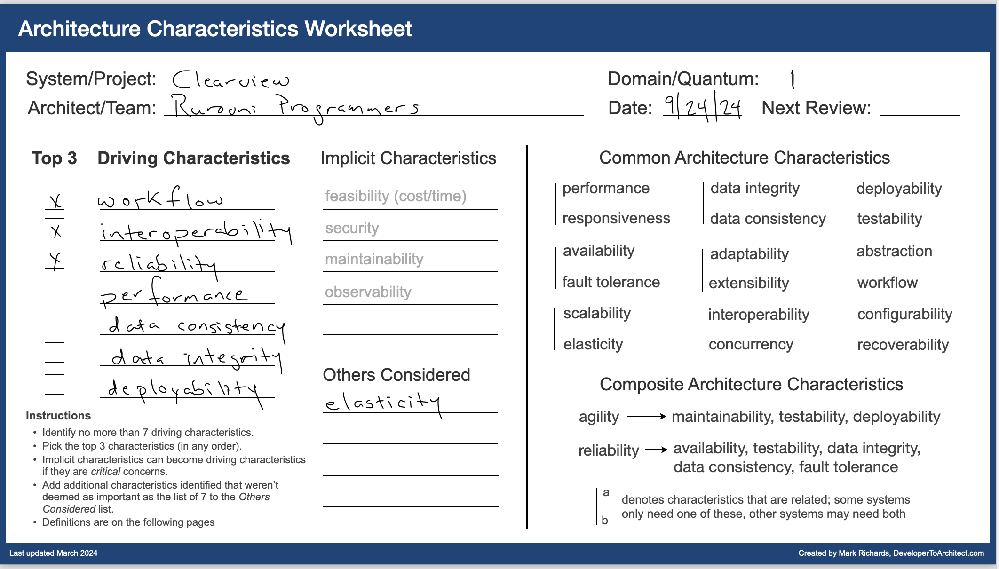
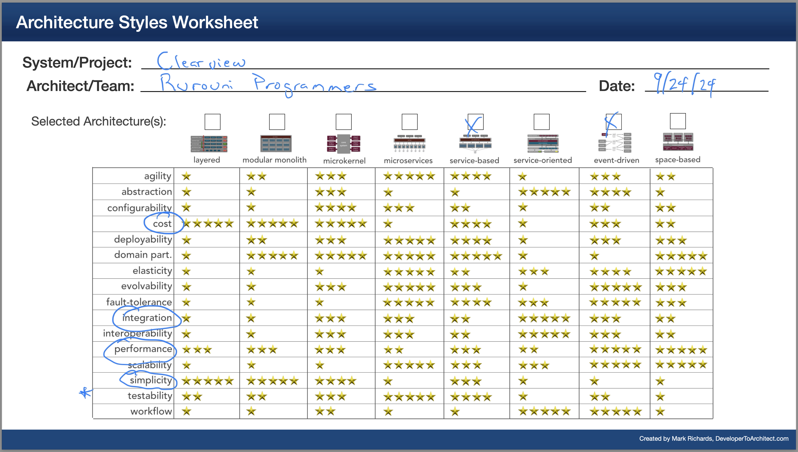

# rurouni-programmers

# 1. Rurouni Programmers
Repository for the Rurouni Programmers team for the [O'Reilly Fall 2024 Archiectural Kata Challenge](https://learning.oreilly.com/live-events/architectural-katas-fall-2024/0642572006974/)

## Team Members
- David Gethers [LinkedIn]()
- Yong Kim [LinkedIn]()
- Richard Bellamy [LinkedIn]()

## Introduction

### Mission

[Diversity Cyber Council](https://www.diversitycybercouncil.com/) is a 501c3 Non-Profit that
serves under-represented demographics in the tech industry by facilitating education, training,
and staffing opportunities to establish a sustainable and diverse talent pipeline to the workforce.

### Company Information
ClearView is a supplemental HR platform that anonymizes candidate
information while highlighting objective skills and qualifying experience to reduce bias in the
hiring process. Clear View will also be service based, enabling DEI consultants to shadow
employer interviews to rate the interviewer and report findings to executive management in an
effort to proactively and strategically reduce bias in the interview process.

### Users
* Employers - companies invested in providing a more equitable experience to career seekers.
* Job Candidate - professionals seeking a less tedious and more equitable hiring process
  that values their skills and abilities.
* Administrators - Management of the platform, registering users, providing data analytic
  reports on company performance and solution building services with executives.

## Requirements
* The platform must leverage AI to re-construct job seeker resumes into a S.M.A.R.T goal
  format and quantifiable align their experience to open roles posted by the hiring
  manager.
* Similarity Score/Match with job descriptions is a hard requirements.
* AI provided resume tips is a hard requirement.
* AI eliminating any potential racial, lifestyle, cultural, etc. indicators is a hard requirement.
* Back end process data aggregation is a hard requirement.

## Data Points:
* Data Point 1 - Deciding to move forward with a candidate
* Data Point 2 - Unlocking a full candidate profile to offer an interview
* Data Point 3 - 5 question survey to job candidate about interviewer
* Data Point 4 - 5 question survey to interviewer about job candidate
* Data Point 5 - Accumulation of demographic data after rejecting a candidate or
presenting an offer

Monthly data and analytic report presenting KPI metrics as it relates to the interview and hiring
process.

## Architeture characteristics

## Choosing the architecture

## Designing the architecture

## Use Cases

## Team Topologies